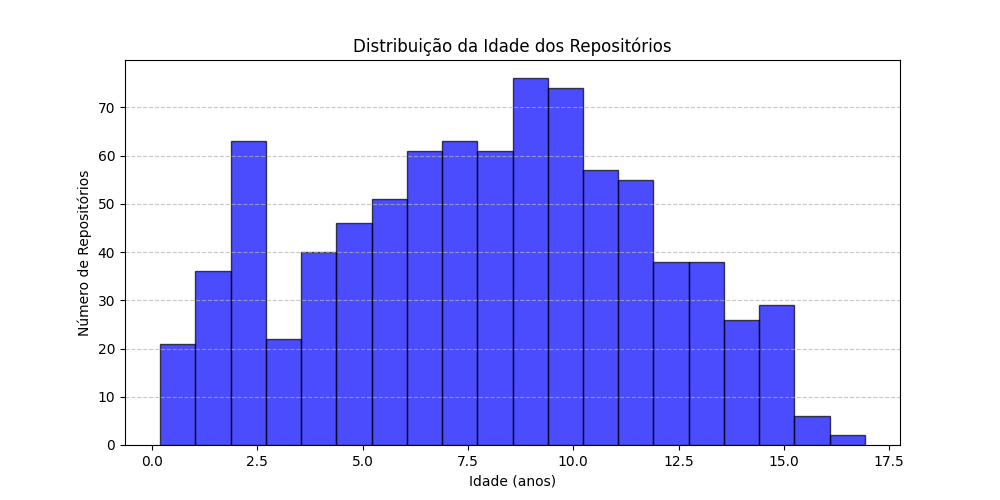
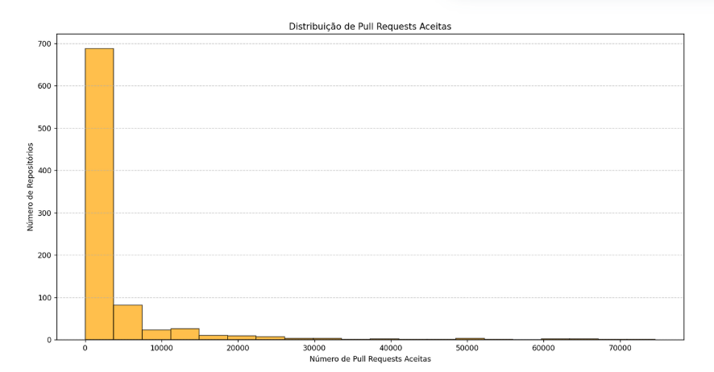
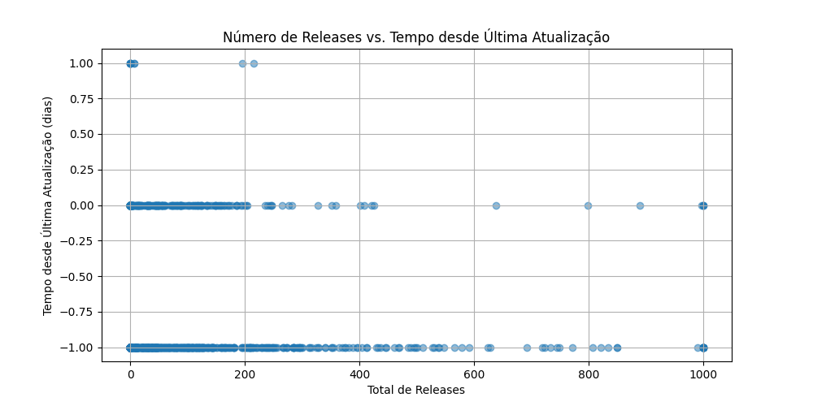
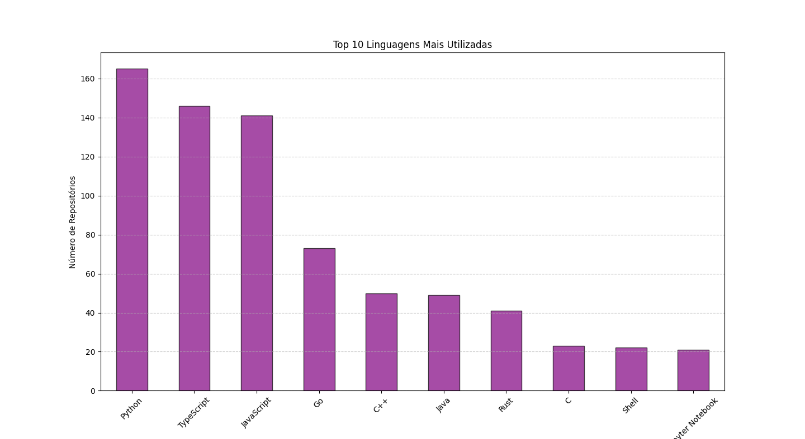
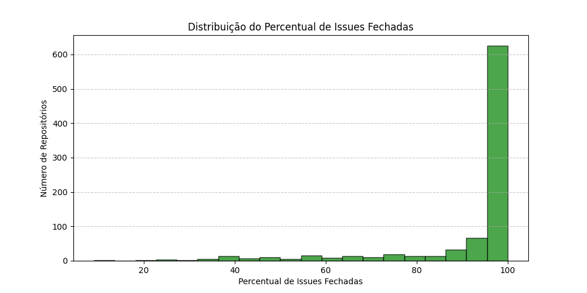

# Relatório Final: Características de Repositórios Populares

## Alunas: Letícia Rodrigues Blom de Paula e Júlia Borges Araújo Silva

## 1. Introdução

Este estudo tem como objetivo analisar as principais características de repositórios populares no GitHub. Foram investigadas questões relacionadas à maturidade dos projetos, volume de contribuições externas, frequência de lançamento de releases, atividade recente, popularidade das linguagens utilizadas e eficiência na resolução de issues.

As hipóteses iniciais levantadas foram:

**Hipótese 1**: Repositórios populares tendem a ser mais antigos, pois a popularidade é acumulada ao longo do tempo.

**Hipótese 2**: Repositórios populares tendem a receber mais contribuições externas, pois sua visibilidade atrai desenvolvedores interessados.

**Hipótese 3**: Repositórios populares tendem a ter ciclos de lançamento regulares para manter a base de usuários engajada.

**Hipótese 4**: Repositórios populares costumam ter atividades frequentes, pois a comunidade contribui constantemente para sua evolução.

**Hipótese 5**: Linguagens amplamente adotadas, como JavaScript, Python e Java, são predominantes entre os repositórios mais populares.

**Hipótese 6**: Projetos bem gerenciados tendem a manter um alto percentual de issues fechadas, indicando boa manutenção e suporte à comunidade.

## 2. Metodologia

Para responder às questões de pesquisa, foram coletados dados dos 1.000 repositórios com maior número de estrelas no GitHub. As métricas utilizadas para cada questão foram:

- **RQ 01**: Idade do repositório (data de criação)
- **RQ 02**: Total de pull requests aceitas
- **RQ 03**: Total de releases lançadas
- **RQ 04**: Tempo até a última atualização
- **RQ 05**: Linguagem primária utilizada
- **RQ 06**: Percentual de issues fechadas

Os dados foram analisados a partir de valores medianos e, para métricas categóricas, foram feitas contagens por categoria.

A partir disso, os seguintes gráficos foram formulados:

- **Gráfico 1**: Distribuição da Idade dos Repositórios

- **Gráfico 2**: Distribuição de Pull Requests Aceitas

- **Gráfico 3**: Número de Releases vs. Tempo desde Última Atualização

- **Gráfico 4**: Top 10 Linguagens Utilizadas

- **Gráfico 5**: Distribuição do Percentual de Issues Fechadas

## 3. Resultados

### **RQ 01: Sistemas populares são maduros/antigos?**

**Resultado**: A mediana da idade dos repositórios populares é de aproximadamente 8 anos, indicando que a maioria dos repositórios populares são relativamente antigos. Isso confirma a hipótese de que a popularidade é acumulada ao longo do tempo.

### **RQ 02: Sistemas populares recebem muita contribuição externa?**

**Resultado**: A mediana do total de pull requests aceitas é alta, sugerindo que repositórios populares recebem muitas contribuições externas. Isso reforça a ideia de que maior visibilidade atrai desenvolvedores interessados.

### **RQ 03: Sistemas populares lançam releases com frequência?**

**Resultado**: A maioria dos repositórios têm um ciclo de lançamento regular, com médias indicando que releases são feitas ao menos algumas vezes ao ano. Esse resultado confirma a hipótese de que repositórios populares mantêm ciclos frequentes de lançamento para manter a base de usuários engajada.

### **RQ 04: Sistemas populares são atualizados com frequência?**

**Resultado**: O tempo até a última atualização é geralmente baixo, indicando que repositórios populares possuem atividades constantes. Isso valida a hipótese de que a comunidade está sempre contribuindo para sua evolução.

### **RQ 05: Sistemas populares são escritos nas linguagens mais populares?**

**Resultado**: As linguagens mais comuns entre os repositórios populares são **JavaScript, Python e Java**, corroborando a hipótese de que linguagens amplamente adotadas dominam os projetos populares.

### **RQ 06: Sistemas populares possuem um alto percentual de issues fechadas?**

**Resultado**: A mediana do percentual de issues fechadas é alta, sugerindo que projetos populares tendem a ser bem gerenciados, com boa manutenção e suporte à comunidade.

## 4. Discussão

Os resultados obtidos confirmam em grande parte as hipóteses iniciais. Projetos populares são geralmente antigos, altamente colaborativos, atualizados frequentemente e escritos em linguagens amplamente utilizadas. Isso sugere que a popularidade de um repositório está fortemente associada à sua longevidade, facilidade de contribuição e manutenção eficiente.

## 5. Conclusão

Este estudo analisou características de repositórios populares no GitHub e validou diversas hipóteses sobre sua popularidade e manutenção. Os resultados indicam que projetos bem-sucedidos possuem ciclos de desenvolvimento ativos, com atualizações frequentes e um fluxo contínuo de melhorias. Além disso, observou-se uma alta taxa de contribuição externa, sugerindo que a colaboração da comunidade desempenha um papel fundamental na longevidade e evolução desses projetos. A popularidade de um repositório parece estar diretamente ligada à sua capacidade de atrair e engajar desenvolvedores, seja por meio de um código bem documentado, um processo estruturado de revisão de contribuições ou pela escolha de tecnologias amplamente utilizadas. Essas informações podem ser extremamente úteis para desenvolvedores e mantenedores que buscam aumentar o impacto de seus repositórios open-source, fornecendo insights sobre boas práticas para fomentar uma comunidade ativa, melhorar a visibilidade do projeto e garantir sua manutenção a longo prazo.
